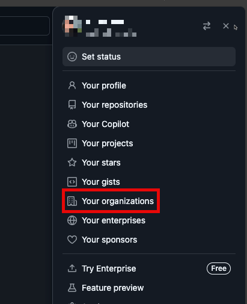
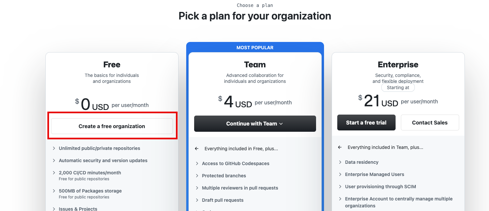
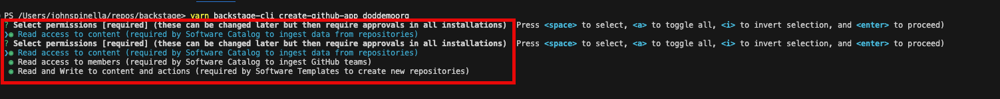
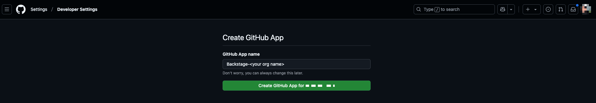
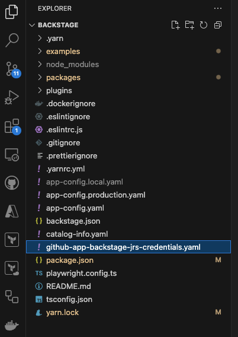

# Hands-on Lab - Platform engineering for Federal with BackStage

Welcome to this Platform engineering for Federal Workshop. In order to comprehend real-world situations, you will be testing with Azure services in several labs.
You will be able to learn how to deploy and manage Azure resources, as well as how to use Azure services to build and deploy applications with the help of GitHub and Backstage.
Don't worry; you will be walked through the entire procedure in this step-by-step lab.

You will receive guidance on how to do each step throughout this workshop. You will be able to test your knowledge and skills by completing the labs.
Before seeing the solutions listed under the provided resources and links, it is advised to look at the solutions placed under the '📚 Toggle solution' panel.

<div class="task" data-title="Task">

> You will find the instructions and expected configurations for each Lab step in these yellow **TASK** boxes.
> Inputs and parameters to select will be defined, all the rest can remain as default as it has no impact on the scenario.

</div>

## Pre-requisites

Before starting this lab, be sure to set your Azure environment :

- An Azure Subscription with the **Owner** role to create and manage the labs' resources and deploy the infrastructure as code
- Register the Azure providers on your Azure Subscription if not done yet: `Microsoft.KeyVault`, `Microsoft.Web`, `Microsoft.App`.
- Install the `Azure CLI` on your local machine or use the Azure Cloud Shell
- Install `Terraform` on your local machine
- A `GitHub account` to create a GitHub App and use the GitHub integration in Backstage

To be able to do the lab content you will also need:

- Basic understanding of Azure resources.
- A Github account (Free, Team or Enterprise)
- Create a [fork](https://github.com/join) of the repository from the **main** branch to help you keep track of your potential changes


3 development options are available:
  - 🥇 **Preferred method** : Pre-configured GitHub Codespace 
  - 🥈 Local Devcontainer
  - 🥉 Local Dev Environment with all the prerequisites detailed below

<div class="tip" data-title="Tips">

> To focus on the main purpose of the lab, we encourage the usage of devcontainers/codespace as they abstract the dev environment configuration, and avoid potential local dependencies conflict.
> 
> You could decide to run everything without relying on a devcontainer : To do so, make sure you install all the prerequisites detailed below.

</div>

### 🥇 : Pre-configured GitHub Codespace

To use a Github Codespace, you will need :
- [A GitHub Account](https://github.com/join)

Github Codespace offers the ability to run a complete dev environment (Visual Studio Code, Extensions, Tools, Secure port forwarding etc.) on a dedicated virtual machine.
The configuration for the environment is defined in the `.devcontainer` folder, making sure everyone gets to develop and practice on identical environments : No more conflict on dependencies or missing tools !

Every Github account (even the free ones) grants access to 120 vcpu hours per month, _**for free**_. A 2 vcpu dedicated environment is enough for the purpose of the lab, meaning you could run such environment for 60 hours a month at no cost!

To get your codespace ready for the labs, here are a few steps to execute :

- Start by forking the repository. Click on `Fork` and get a new copy of the repository which is now yours and that you can edit at your will.
- After you forked the repo, click on `<> Code`, `Codespaces` tab and then click on the `+` button:


- You can also provision a beefier configuration by defining creation options and select the **Machine Type** you like: 


### 🥈 : Using a local Devcontainer

This repo comes with a Devcontainer configuration that will let you open a fully configured dev environment from your local Visual Studio Code, while still being completely isolated from the rest of your local machine configuration : No more dependency conflict.
Here are the required tools to do so :

- [Git client](https://git-scm.com/downloads)
- [Docker Desktop](https://www.docker.com/products/docker-desktop/) running
- [Visual Studio Code](https://code.visualstudio.com/) installed

Start by cloning the Hands-on Lab Platform engineering for Federal repo you just forked on your local Machine and open the local folder in Visual Studio Code.
Once you have cloned the repository locally, make sure Docker Desktop is up and running and open the cloned repository in Visual Studio Code.  

You will be prompted to open the project in a Dev Container. Click on `Reopen in Container`.

If you are not prompted by Visual Studio Code, you can open the command palette (`Ctrl + Shift + P`) and search for `Reopen in Container` and select it: 


### 🥉 : Using your own local environment

The following tools and access will be necessary to run the lab in good conditions on a local environment :  

- [Git client](https://git-scm.com/downloads)
- [Visual Studio Code](https://code.visualstudio.com/) installed (you will use Dev Containers)
- [Azure CLI](https://learn.microsoft.com/en-us/cli/azure/install-azure-cli) installed on your machine
- [Terraform](https://learn.hashicorp.com/tutorials/terraform/install-cli) installed, this will be used for deploying the resources on Azure

Once you have set up your local environment, you can clone the Hands-on Lab Platform engineering for Federal repo you just forked on your machine, and open the local folder in Visual Studio Code and head to the next step. 

## 🔑 Sign in to Azure

<div class="task" data-title="Task">

> - Log into your Azure subscription in your environment using Azure CLI and on the [Azure Portal](https://portal.azure.com/) using your credentials.

</div>

<details>

<summary>📚 Toggle solution</summary>

```bash
# Login to Azure : 
# --tenant : Optional | In case your Azure account has access to multiple tenants

# Option 1 : Local Environment or Dev Container
az login --tenant <yourtenantid or domain.com>
# Option 2 : Github Codespace : you might need to specify --use-device-code parameter to ease the az cli authentication process
az login --use-device-code --tenant <yourtenantid or domain.com>

# Display your account details
az account show
# Select your Azure subscription
az account set --subscription <subscription-id>

# Register the following Azure providers if they are not already

# Azure Key Vault
az provider register --namespace 'Microsoft.KeyVault'
# Azure Functions & Azure Web Apps
az provider register --namespace 'Microsoft.Web'
# Azure Container Apps
az provider register --namespace 'Microsoft.App'
```

</details>

# Module 2 - Lab 1 - Install Backstage

In this lab, we will initialize the standalone app for the moment. In the later labs, we will add an external database to it and deploy it to Azure. As well as, do some configurarion to make it work with Azure and GitHub.

To get set up quickly with your own Backstage project you can create a Backstage App. We will run Backstage locally and configure the app.

A Backstage App is a monorepo setup with `lerna` that includes everything you need to run Backstage in your own environment.

## Step 1 - Create a Backstage App

Backstage provides a utility for creating new apps. It guides you through the initial setup of selecting the name of the app and a database for the backend.

To create a new app, run the following command:

```shell
npx @backstage/create-app@latest
```

<details>
<summary>📚 Toggle solution</summary>

```shell
npx @backstage/create-app@latest
```

If prompted, enter a name for the app. This will be the name of the directory that is created. We suggest to use `backstage`

```shell
? Enter a name for the app [required] backstage

Creating the app...

 Checking if the directory is available:
  checking      backstage ✔ 

 Creating a temporary app directory:

 Preparing files:
  copying       .dockerignore ✔ 
  copying       .eslintignore ✔ 
  templating    .eslintrc.js.hbs ✔ 
  templating    .gitignore.hbs ✔ 
  copying       .prettierignore ✔ 
  copying       README.md ✔ 
  copying       app-config.local.yaml ✔ 
  copying       app-config.production.yaml ✔ 
  templating    app-config.yaml.hbs ✔ 
  templating    backstage.json.hbs ✔ 
  templating    catalog-info.yaml.hbs ✔ 
  copying       lerna.json ✔ 
  templating    package.json.hbs ✔ 
  copying       playwright.config.ts ✔ 
  copying       tsconfig.json ✔ 
  copying       yarn.lock ✔ 
  copying       README.md ✔ 
  copying       entities.yaml ✔ 
  copying       org.yaml ✔ 
  copying       template.yaml ✔ 
  copying       catalog-info.yaml ✔ 
  copying       index.js ✔ 
  copying       package.json ✔ 
  copying       README.md ✔ 
  templating    .eslintrc.js.hbs ✔ 
  copying       Dockerfile ✔ 
  copying       README.md ✔ 
  templating    package.json.hbs ✔ 
  copying       index.test.ts ✔ 
  copying       index.ts ✔ 
  copying       types.ts ✔ 
  copying       app.ts ✔ 
  copying       auth.ts ✔ 
  copying       catalog.ts ✔ 
  copying       proxy.ts ✔ 
  copying       scaffolder.ts ✔ 
  templating    search.ts.hbs ✔ 
  copying       techdocs.ts ✔ 
  copying       .eslintignore ✔ 
  templating    .eslintrc.js.hbs ✔ 
  templating    package.json.hbs ✔ 
  copying       android-chrome-192x192.png ✔ 
  copying       apple-touch-icon.png ✔ 
  copying       favicon-16x16.png ✔ 
  copying       favicon-32x32.png ✔ 
  copying       favicon.ico ✔ 
  copying       index.html ✔ 
  copying       manifest.json ✔ 
  copying       robots.txt ✔ 
  copying       safari-pinned-tab.svg ✔ 
  copying       app.test.ts ✔ 
  copying       App.test.tsx ✔ 
  copying       App.tsx ✔ 
  copying       apis.ts ✔ 
  copying       index.tsx ✔ 
  copying       setupTests.ts ✔ 
  copying       LogoFull.tsx ✔ 
  copying       LogoIcon.tsx ✔ 
  copying       Root.tsx ✔ 
  copying       index.ts ✔ 
  copying       EntityPage.tsx ✔ 
  copying       SearchPage.tsx ✔ 

 Moving to final location:
  moving        backstage ✔ 

 Installing dependencies:
  determining   yarn version ✔ 
  executing     yarn install ✔ 
  executing     yarn tsc ✔ 

🥇  Successfully created backstage


 All set! Now you might want to:
  Run the app: cd backstage && yarn dev
  Set up the software catalog: https://backstage.io/docs/features/software-catalog/configuration
  Add authentication: https://backstage.io/docs/auth/
```

</details>

This can take a few minutes to complete. But you should see the current progress in the terminal.

You should now have a new directory called `backstage` in your root directory, which contains following files and
folders:

```shell
backstage/
├── README.md
├── app-config.local.yaml
├── app-config.production.yaml
├── app-config.yaml
├── backstage.json
├── catalog-info.yaml
├── dist-types
│   ├── packages
│   └── tsconfig.tsbuildinfo
├── examples
│   ├── entities.yaml
│   ├── org.yaml
│   └── template
├── lerna.json
├── package.json
├── packages
│   ├── README.md
│   ├── app
│   └── backend
├── playwright.config.ts
├── plugins
│   └── README.md
├── tsconfig.json
└── yarn.lock
```

* **app-config.yaml**: Main configuration file for the app.
* **catalog-info.yaml**: Catalog Entities descriptors.
* **lerna.json**: Contains information about workspaces and other lerna configuration needed for the monorepo setup.
* **package.json**: Root package.json for the project. Note: Be sure that you don't add any npm dependencies here as
  they
  probably should be installed in the intended workspace rather than in the root.
* **packages/**: Lerna leaf packages or "workspaces". Everything here is going to be a separate package, managed by
  lerna.
* **packages/app/**: An fully functioning Backstage frontend app, that acts as a good starting point for you to get to
  know
  Backstage.
* **packages/backend/**: The backend for Backstage. This is where you can add your own backend logic.

## Step 2 - Run the App

As soon as the app is created, you can run it by navigating into the `backstage` directory and running the following command:

```shell
cd backstage
yarn dev
```

The yarn dev command will run both the frontend and backend as separate processes (named [0] and [1]) in the same
window. When the command finishes running, it should open up a browser window displaying your app. If not, you can open
a browser and directly navigate to the frontend at `http://localhost:3000`.

<details>
<summary>📚 Toggle solution</summary>

```shell
cd backstage
yarn dev
```

</details>

## Step 3 - Explore the App

Let's have a look on some of the values in the different files and change them to your needs.


First we change the name of our organization in the `app-config.yaml` file. Open the file and change the organization name to a name of your choice.

```yaml
organization:
  name: <your organization name>
```

Because we are still in the development mode, any changes to the `app-config.yaml` file will be reflected in the app as soon as you save the file. You can see the changes in the browser window.

<div class="task" data-title="Task">

> If you do not see the changes in the browser window, try to refresh the page.

</div>

## Step 4 - Add GitHub Organization

In order to use the full potential of Backstage, you need to add a GitHub organization to the app. This will allow you to use the GitHub integration to fetch data from your GitHub repositories.

To add a GitHub organization, follow these steps:

1. Go to Github.com and click on your profile picture in the top right corner.
2. Go to 'Your organizations'

3. You will be at your organizations list, click on 'New organization' in the top right corner of the screen.
4. Click Free Organization.

5. Enter a name for your organization, email, set to personal account and click 'Next'.

We will use this organization in the next labs to authenicate and fetch data from GitHub from Backstage.

## Step 5 - Add GitHub Auth Integration

The Backstage `core-plugin-api` package comes with a Microsoft authentication provider that can authenticate users using GitHub or GitHub Enterprise OAuth. This provider can be configured to use a GitHub App or an OAuth App. In this lab, we will use an OAuth App.

### Create an OAuth App for your GitHub Organization

To add GitHub authentication to Backstage, you must create either a GitHub App, or an OAuth App from the GitHub developer settings. The Homepage URL should point to Backstage's frontend, while the Authorization callback URL will point to the auth backend.

#### Using the CLI (public GitHub only)

To create an OAuth App on GitHub in your Organization, follow these steps:

You can use the backstage-cli to create a GitHub App using a manifest file that we provide. This gives us a way to automate some of the work required to create a GitHub app.

```shell
yarn backstage-cli create-github-app <github org>
```

This command will guide you through the process of creating a GitHub App. You will be asked to provide the following information:

- **Select permissions:** Select 'A' for all permissions.



A new window will open in your browser where you can create the GitHub App. Fill in the form with the following values:

- **GitHub App name:** Backstage-'<'your org name'>'



Once you've gone through the CLI command, it should produce a YAML file in the root of the project which you can then use as an include in your app-config.yaml.



#### Including in Integrations Config

You can include the generated GitHub App configuration in your app-config.yaml file like this:

```yaml
integrations:
  github:
    - host: github.com
      apps:
        - $include: example-backstage-app-credentials.yaml
```

<div class="tip" data-title="Tips">

> Please note that the credentials file is highly sensitive and should NOT be checked into any kind of version control. Instead use your preferred secure method of distributing secrets.

</div>

#### Adding the GitHub App to Backstage

Now we need to make sure the GitHub app is able to access Backstage.

Fill in the form with the following values in the Github App settings:

- **Homepage URL:** http://localhost:3000
- **Authorization callback URL:** http://localhost:7007/api/auth/github/handler/frame

Click on the `Save changes` button.

#### Configuring App permissions

The GitHub App permissions can be configured in the GitHub App settings. Which is located at `https://github.com/organizations/{ORG}/settings/apps/{APP_NAME}/permissions` or clicking on the `Permissions & events` tab in the GitHub App settings.

The permissions required for the GitHub App to work with Backstage are:

**Reading software components:**

- Contents: Read-only
- Commit statuses: Read-only

**Reading organization data:**

- Members: Read-only

**Publishing software templates:**

- Administration: Read & write (for creating repositories)
- Contents: Read & write
- Metadata: Read-only
- Pull requests: Read & write
- Issues: Read & write
- Workflows: Read & write (if templates include GitHub workflows)
- Variables: Read & write (if templates include GitHub Action Repository Variables)
- Secrets: Read & write (if templates include GitHub Action Repository Secrets)
- Environments: Read & write (if templates include GitHub Environments)

<div class="tip" data-title="Tips">

> If you're using a GitHub App, the allowed scopes are configured as part of that app. This means you need to verify what scopes the plugins you use require, so be sure to check the plugin READMEs for that information.

</div>

### Configure GitHub Auth in Backstage

The provider configuration can then be added to your app-config.yaml under the root auth configuration:

```yaml
auth:
  environment: development
  providers:
    github:
      development:
        clientId: ${AUTH_GITHUB_CLIENT_ID}
        clientSecret: ${AUTH_GITHUB_CLIENT_SECRET}
        ## uncomment if using GitHub Enterprise
        # enterpriseInstanceUrl: ${AUTH_GITHUB_ENTERPRISE_INSTANCE_URL}
        signIn:
          resolvers:
            # See https://backstage.io/docs/auth/github/provider#resolvers for more resolvers
            - resolver: usernameMatchingUserEntityName

```

The GitHub provider is a structure with these configuration keys:

- **clientId:** The client ID that you generated on GitHub, e.g. b59241722e3c3b4816e2
- **clientSecret:** The client secret tied to the generated client ID.
- **enterpriseInstanceUrl (optional):** The base URL for a GitHub Enterprise instance, e.g. https://ghe.<company>.com. Only needed for GitHub Enterprise.
- **callbackUrl (optional):** The callback URL that GitHub will use when initiating an OAuth flow, e.g. https://your-intermediate-service.com/handler. Only needed if Backstage is not the immediate receiver (e.g. one OAuth app for many backstage instances).
- **signIn:** The configuration for the sign-in process, including the resolvers that should be used to match the user from the auth provider with the user entity in the Backstage catalog (typically a single resolver is sufficient).

#### GitHub Resolvers

This provider includes several resolvers out of the box that you can use:

- **emailMatchingUserEntityProfileEmail:** Matches the email address from the auth provider with the User entity that has a matching spec.profile.email. If no match is found it will throw a NotFoundError.
- **emailLocalPartMatchingUserEntityName:** Matches the local part of the email address from the auth provider with the User entity that has a matching name. If no match is found it will throw a NotFoundError.
- **usernameMatchingUserEntityName:** Matches the username from the auth provider with the User entity that has a matching name. If no match is found it will throw a NotFoundError.

<div class="tip" data-title="Tips">

> The resolvers will be tried in order, but will only be skipped if they throw a NotFoundError.

</div>

### Backend Installation

To add the provider to the backend we will first need to install the package by running this command from your **Backstage root directory**:

```typescript
yarn --cwd packages/backend add @backstage/plugin-auth-backend-module-github-provider
```

Then we will need to add this line in **packages/backend/src/index.ts**:

```typescript
backend.add(import('@backstage/plugin-auth-backend-module-github-provider'));
```

### Adding the provider to the Backstage frontend

Now that the backend is set up, you can add the GitHub provider to the frontend. This is done by adding the provider to the SignInPage component in the app. The SignInPage component is a component that is used to sign in to the app. Add the following code in **packages/app/src/App.tsx**:

```typescript
import { githubAuthApiRef } from '@backstage/core-plugin-api';
import { SignInPage } from '@backstage/core-components';

const app = createApp({
 components: {
    SignInPage: props => (
      <SignInPage
        {...props}
        auto
        provider={{
          id: 'github-auth-provider',
          title: 'GitHub',
          message: 'Sign in using GitHub',
          apiRef: githubAuthApiRef,
        }}
      />
    ),
  },
  // ..
});
```

<div class="tip" data-title="Tips">

> You can configure sign-in to use a redirect flow with no pop-up by adding enableExperimentalRedirectFlow: true to the root of your app-config.yaml

</div>

### Adding GitHub Organizational Data

The GitHub provider can also be configured to fetch organizational data from GitHub. This data can be used to filter the users that are allowed to sign in to Backstage.

This can be done by adding the **@backstage/plugin-catalog-backend-module-github-org** package to your backend.

### Backend Installation

The package is not installed by default, therefore you have to add **@backstage/plugin-catalog-backend-module-github-org** to your backend package.

Run the following command from your **Backstage root directory**:

```typescript
yarn --cwd packages/backend add @backstage/plugin-catalog-backend-module-github-org
```

Next add the basic configuration to the **app-config.yaml** file:

```yaml
catalog:
  providers:
    githubOrg:
      id: production
      githubUrl: https://github.com
      orgs: ['<Your Org Name>']
      schedule:
        initialDelay: { seconds: 30 }
        frequency: { hours: 1 }
        timeout: { minutes: 50 }
```

Finally, update your backend by adding to **packages/backend/src/index.ts**  following line:

```typescript
backend.add(import('@backstage/plugin-catalog-backend-module-github-org'));
```

You have completed the first lab. You have created a new Backstage app and explored the app.

# Module 4 - Lab 2 - Paved Paths

In this lab, we will discuss how to implement paved paths in Backstage. Paved paths are predefined paths that provide a set of best practices and configurations for specific types of applications.

Paved paths can be used to create new projects based on predefined templates. These templates can include configuration files, code snippets, and other resources that help developers get started quickly with a new project.

## Step 1 - Add GitHub Catalog Integration

The GitHub integration has a discovery provider for discovering catalog entities within a GitHub organization. The provider will crawl the GitHub organization and register entities matching the configured path. This can be useful as an alternative to static locations or manually adding things to the catalog. This is the preferred method for ingesting entities into the catalog.

 This can be done by adding the **@backstage/plugin-catalog-backend-module-github** package to your backend.

### Installation

The package is not installed by default, therefore you have to add **@backstage/plugin-catalog-backend-module-github** to your backend package.

Run the following command from your **Backstage root directory**:

```typescript
yarn --cwd packages/backend add @backstage/plugin-catalog-backend-module-github
```

Next add the basic configuration to the **app-config.yaml** file:

```yaml
catalog:
  providers:
    github:
      # the provider ID can be any camelCase string
      providerId:
        organization: '<Your Org Name>' # string
        catalogPath: '/catalog-info.yaml' # string
        filters:
          branch: 'main' # string
          repository: '.*' # Regex
        schedule: # same options as in SchedulerServiceTaskScheduleDefinition
          # supports cron, ISO duration, "human duration" as used in code
          frequency: { minutes: 30 }
          # supports ISO duration, "human duration" as used in code
          timeout: { minutes: 3 }
      customProviderId:
        organization: 'new-org' # string
        catalogPath: '/custom/path/catalog-info.yaml' # string
        filters: # optional filters
          branch: 'develop' # optional string
          repository: '.*' # optional Regex
      wildcardProviderId:
        organization: 'new-org' # string
        catalogPath: '/groups/**/*.yaml' # this will search all folders for files that end in .yaml
        filters: # optional filters
          branch: 'develop' # optional string
          repository: '.*' # optional Regex
      topicProviderId:
        organization: 'backstage' # string
        catalogPath: '/catalog-info.yaml' # string
        filters:
          branch: 'main' # string
          repository: '.*' # Regex
          topic: 'backstage-exclude' # optional string
      topicFilterProviderId:
        organization: 'backstage' # string
        catalogPath: '/catalog-info.yaml' # string
        filters:
          branch: 'main' # string
          repository: '.*' # Regex
          topic:
            include: ['backstage-include'] # optional array of strings
            exclude: ['experiments'] # optional array of strings
      validateLocationsExist:
        organization: 'backstage' # string
        catalogPath: '/catalog-info.yaml' # string
        filters:
          branch: 'main' # string
          repository: '.*' # Regex
        validateLocationsExist: true # optional boolean
      visibilityProviderId:
        organization: 'backstage' # string
        catalogPath: '/catalog-info.yaml' # string
        filters:
          visibility:
            - public
            - internal
      enterpriseProviderId:
        host: ghe.example.net
        organization: 'backstage' # string
        catalogPath: '/catalog-info.yaml' # string
```

<div class="task" data-title="Task">

> For large organizations, this plugin can take a long time, so be careful setting low frequency / timeouts and importing a large amount of users / groups for the first try.

> The configuration above is a basic configuration for the Microsoft Graph API. You can find more information about the configuration in the [Backstage documentation](https://backstage.io/docs/features/software-catalog/catalog-integrations#microsoft-graph).

</div>

Finally, updated your backend by adding the following line in **packages/backend/src/index.ts**:

```typescript
backend.add(import('@backstage/plugin-catalog-backend-module-github'));
```

## Step 2 - Add GitHub Integration to Backstage

 


## Implementing Paved Paths in Backstage

In Backstage, paved paths can be implemented using the scaffolder plugin. The scaffolder plugin allows you to create templates for different types of applications and generate new projects based on those templates.

To implement paved paths in Backstage, you can create a new template in the `examples/template` directory. The template should include all the necessary configuration and best practices for a specific type of application.

You can then use the scaffolder plugin to generate new projects based on the template. The scaffolder plugin will create a new project in the `packages` directory with all the necessary configuration and best practices.

# Module 5 - Lab 3 - Everything as Code

In this lab, we will show you how to use Everything as Code in Backstage. **Everything as Code** is a concept that allows you to define your infrastructure, configuration, and application code in a declarative way using code.

We will be doing a couple of things in this lab:

1. Define Infrastructure as Code for deployment of Backstage on Azure
2. Define Configuration as Code for the management of Backstage configuration
3. Define Documentation as Code for the management of Backstage documentation

## Step 1 - Define Infrastructure as Code for deployment of Backstage

In this step, we will define the infrastructure as code for the deployment of Backstage on Azure. We will use Terraform to define the infrastructure as code.

We will use the docker file that comes with the Backstage app to create a Docker image and deploy it to Azure. We will then create a Kubernetes cluster on Azure and deploy the Docker image to the cluster.

### Create a Terraform Configuration File

Create a new Terraform configuration file named `main.tf` in the root directory of your Backstage project. Add the following code to the file:

```hcl
provider "azurerm" {
  features {}
}

resource "azurerm_resource_group" "example" {
  name     = "example-resources"
  location = "East US"
}
```

This code defines an Azure resource group named `example-resources` in the `East US` region.


# Module 6 - Lab 4 - Self-Service Infrastructure

# Closing the workshop

Once you're done with this lab you can delete the resource group you created at the beginning.

To do so, click on `delete resource group` in the Azure Portal to delete all the resources and audio content at once. The following Az-Cli command can also be used to delete the resource group :

```bash
# Delete the resource group with all the resources
az group delete --name <resource-group>
```

Also, for security purpose, remove the unused GitHub PAT token in your GitHub account.